# Core Concepts — Visual Architecture Pack

## 1. Core Mental Model

### The Three Load-Bearing Concepts

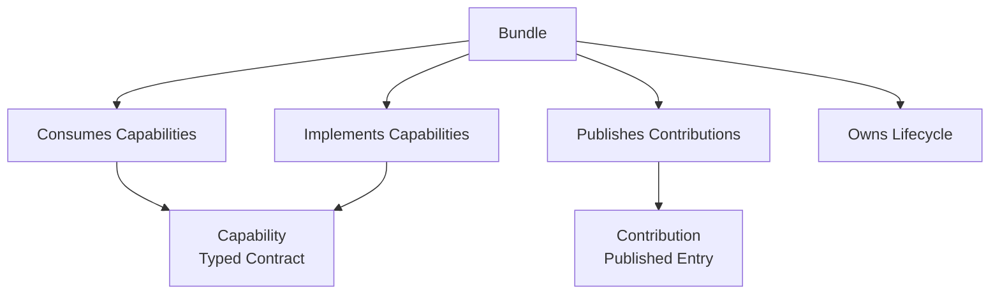

---

### Capability vs Contribution

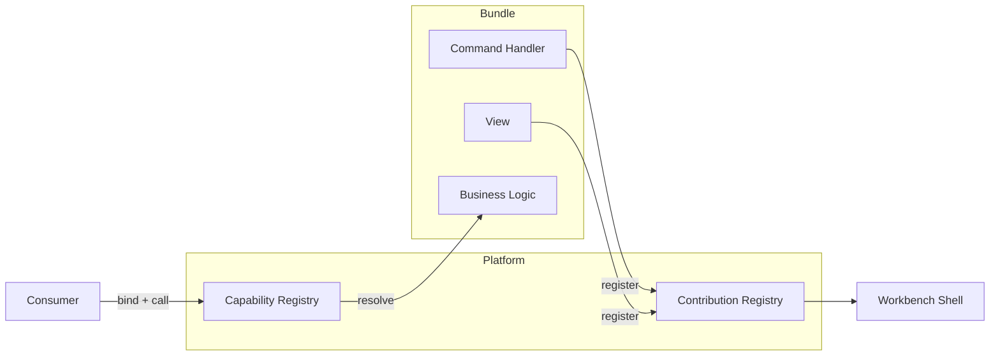

---

## 2. Authority / Process Architecture

### High-Level Process Topology

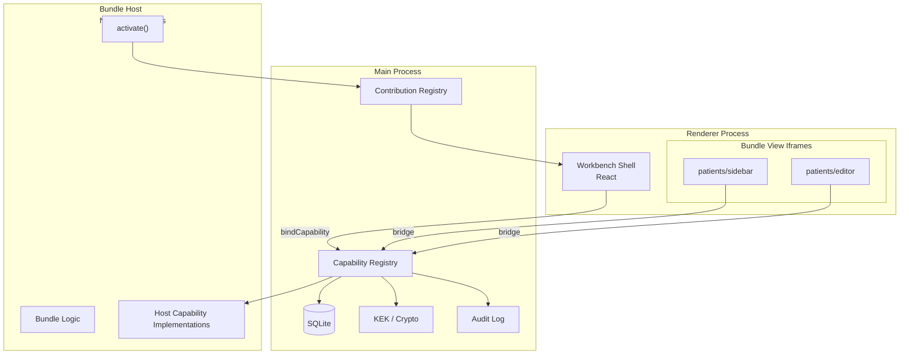

---

### Trust Hierarchy

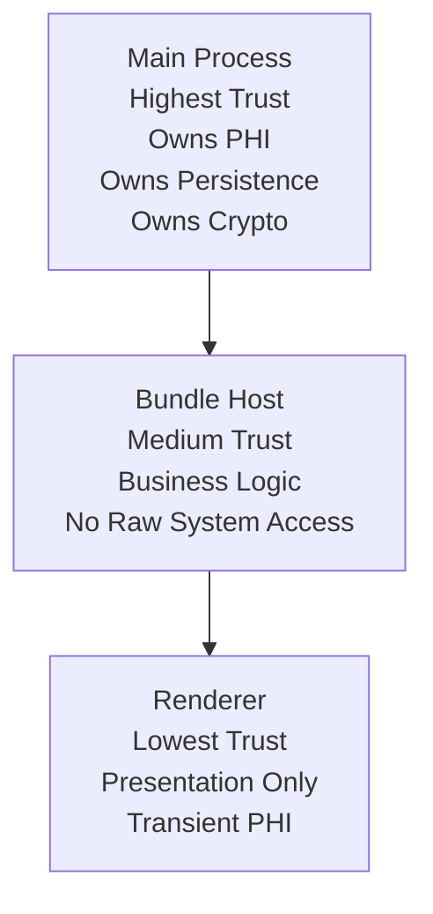

---

### Allowed vs Forbidden Communication

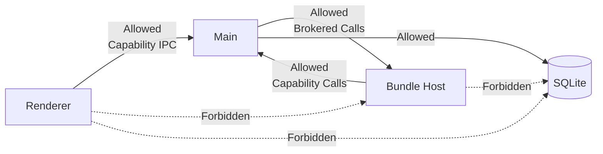

---

## 3. Bundle Anatomy

### Internal Structure of a Bundle

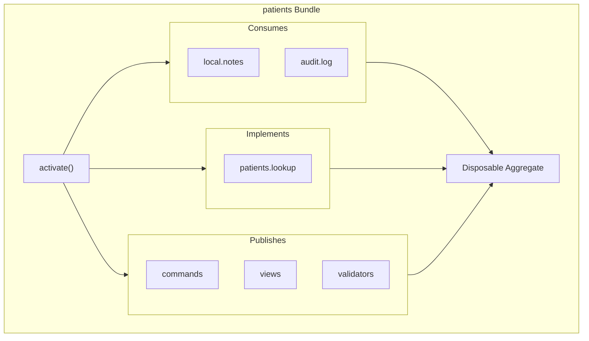

---

### Bundle Spans Two Processes

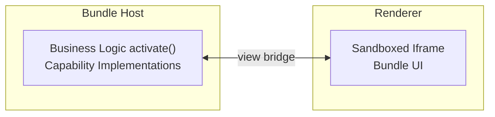

---

## 4. System Diagram

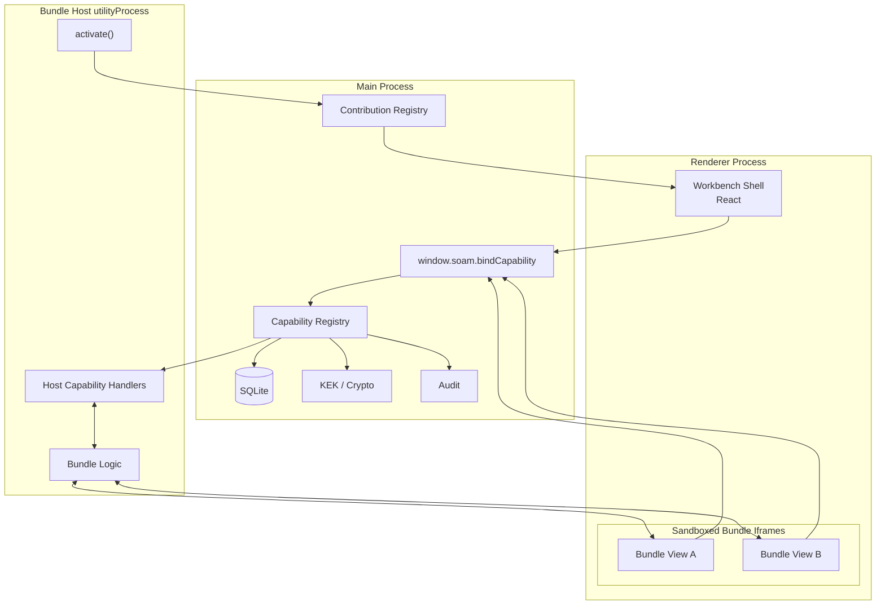

---

## 5. End-to-End Sequence — “Open Patient Record”

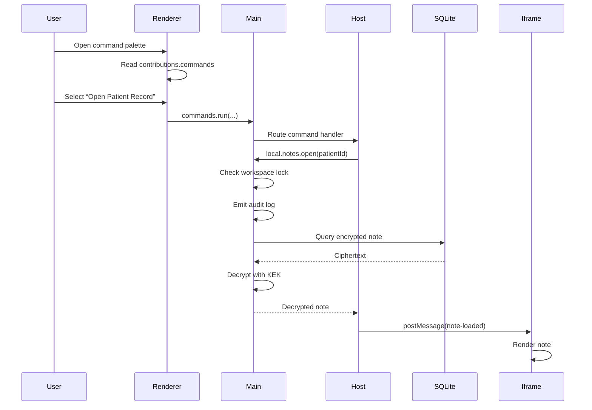

---

## 6. PHI Enforcement Model

### Structural PHI Enforcement

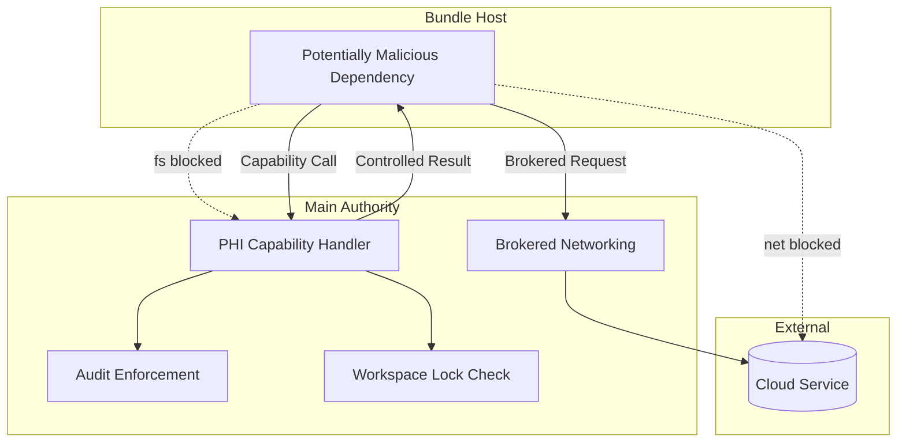

---

### Why Main Owns PHI

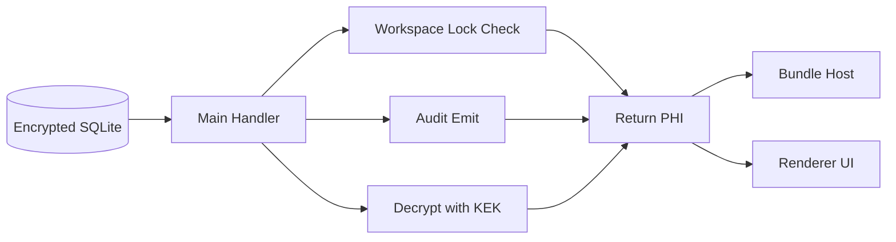

---

## 7. Capability Resolution Flow

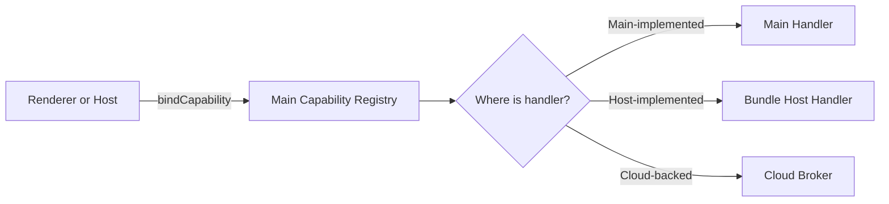

---

## 8. Contribution Flow

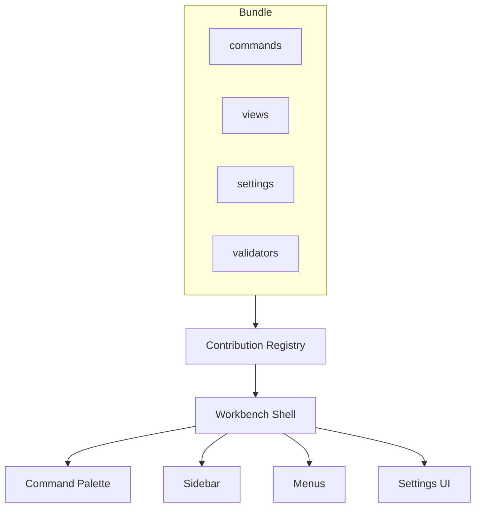

---

## 10. Key Architectural Invariants

### Invariant #1 — One IPC Door

```text
New features do NOT add preload methods.

Everything goes through:

window.soam.bindCapability(...)
```

### Invariant #2 — Renderer Never Reaches Data Directly

```text
Renderer
  -> Capability
    -> Main
      -> Data
```

### Invariant #3 — Shared Logic Moves Down, Never Sideways

```text
Wrong:
Bundle A ---> Bundle B internals

Correct:
Bundle A ---> Capability <--- Bundle B
```
